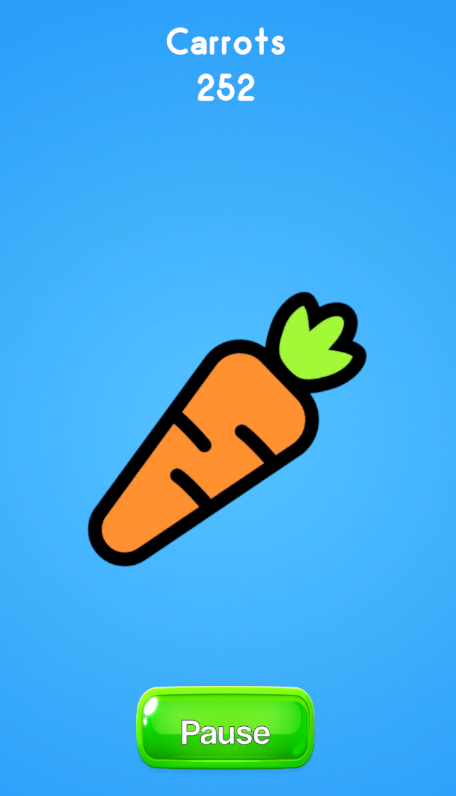
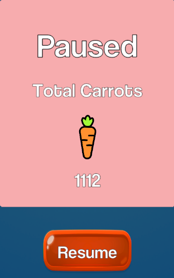

# 🥕 Carrot Clicker

Simple 2D clicker game built with Unity.

Click the carrot to earn carrots.  
Open the resume panel to view your total.  
Progress is saved between sessions.

---

## Screenshots

---

## Features~~~~

- Event-driven currency system
- Physics2D raycast input
- UI click blocking (EventSystem)
- Animated UI panel (LeanTween)
- Object pooling for particles
- PlayerPrefs save system

---

## Tech

- Unity 6
- C#
- LeanTween
- Unity ObjectPool